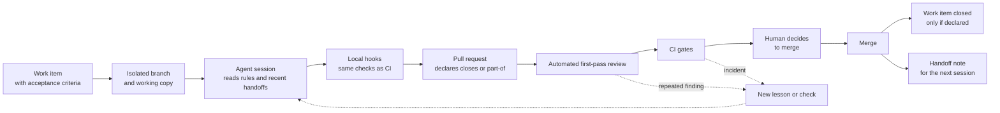

# Governing AI coding agents in a small, regulated-domain team

How a two-person team ships most of its code through AI agents without losing traceability, review or legal defensibility: the controls we use, worked examples of each, what they caught, where they still fall short, and a boilerplate kit to adopt them.

## Summary

AI coding agents are fast, tireless and literal. They follow whatever rule is in front of them, including a rule that is out of date, and they will happily produce a week's worth of change in an afternoon. In a domain where records have legal weight, that speed is only useful if every change can still be traced to a requirement, reviewed, and reconstructed later.

Our answer is a layered set of controls. Each layer catches what the one before it misses:

1. **Written rules** that agents read at the start of every session.
1. **Local hooks** that run the same checks on the developer's machine before code leaves it.
1. **CI gates** that enforce the checks nobody can skip.
1. **Human approval** at the points where judgement matters.
1. **An incident feedback loop** that turns every repeated mistake into a new rule or, better, a new mechanical check.

The result is high throughput with a clean audit trail. The main weakness is that written rules drift ahead of the checks that are supposed to back them. A rule that describes a safeguard which doesn't exist is worse than no rule, because agents trust it.

| Figure | What it measures |
|---|---|
| **~90** | merged pull requests a week, two engineers |
| **1.6 h** | median time from opening a pull request to merge |
| **~3 in 4** | merged pull requests written by an agent session |
| **~86%** | of merged pull requests carry a work-item key; the rest are labelled governance work |

Figures are from one recent month. "Written by an agent session" means the pull request description carries the agent tool's generated footer; the real share is higher because not every session adds one.

## Context

The product is a multi-tenant SaaS application for a regulated industry. Some of its records are statutory: once signed they must never change, corrections are new versions, and an auditor may ask years later who decided a piece of content was correct and when. The team is two engineers and no dedicated QA, security or operations staff.

Almost all implementation work runs through AI coding agents. Engineers write the ticket, start a session, steer, review and merge. Several sessions often run at once on the same machine, and cheaper or free agents take mechanical work such as bulk renames and boilerplate.

That set-up has three risks a conventional team doesn't face at the same scale:

- **Volume outruns review.** Two people can't read ninety pull requests a week line by line.
- **Agents don't carry memory.** Each session starts cold, so a lesson learned on Monday is gone on Tuesday unless it's written down somewhere the next session will read.
- **Parallel sessions collide.** They share a machine, a test database, ports and the issue tracker.

Throughout this paper, **Example** blocks show what a principle or control looks like in daily use. They are illustrative: ticket keys such as `PROJ-412`, file names, messages and data are invented or generalised. Copy-ready versions of the templates and scripts are in the [boilerplate kit](#boilerplate-kit) at the end.

## Principles

### 1. Mechanical beats written

A rule an agent can ignore will eventually be ignored, usually by a session that read a different file first. Wherever a rule can be checked by a script, it should be, and the prose should point at the script. Prose is for judgement calls.

>
> **A written rule becomes a check**
>
> The rule "every new database table must have an access policy" lived in the rules folder for weeks. Agents mostly followed it. Then one session added a table in a migration that also renamed three others, and forgot the policy. A CI script now reads each new migration, lists the tables it creates, and fails if any has no matching policy in the same change:
>
> ```text
> FAIL  access-policy guard
>   migrations/0142_add_supplier_notes.sql creates table "supplier_notes"
>   but no policy for "supplier_notes" exists in this change.
>   Add one, or see rules/database.md#access-policies.
> ```
>
> The prose rule still exists, but now it explains the check and points to it. It is no longer the only defence.
>

### 2. Check the same thing in two places

Every CI gate that can run locally also runs in a pre-push hook, using the same parser or script. The agent sees the failure in seconds, before a CI run is spent, and the CI gate remains the backstop for anyone who skipped the hook.

>
> **One parser, two callers**
>
> The script that decides which tickets a pull request closes is one file. CI runs it against the published description. The pre-push hook runs it against the description of the pull request already open for the branch. An agent that declares the same ticket two ways sees this on the laptop a minute before CI would:
>
> ```text
> pre-push: closure declaration
>   PROJ-318 is declared both "Closes" and "Part of". Pick one.
> ```
>
> See boilerplate [B10](../scripts/closure-keys.mjs).
>

### 3. No work without a work item

Every change that affects product behaviour carries a ticket key in its branch or title, and CI blocks the merge otherwise. For a regulated product this is the audit trail: requirement, change, review and release are linked without anyone assembling them afterwards.

>
> **From a tester's bug report to the release that fixed it**
>
> A tester reports that an expired sign-in link shows a blank page, ticket `PROJ-412`. The session works on `fix/PROJ-412-expired-link-message`, and the pull request title and description carry the key. Months later, an auditor asks when this was fixed and who reviewed it. One search answers it: the ticket, branch, pull request, review comments, CI run and release notes all share the key. A branch called `fix/login-thing` fails the build:
>
> ```text
> FAIL  work-item reference
>   No ticket key found in branch "fix/login-thing" or the PR title.
>   Rename the branch to fix/PROJ-<n>-..., or add the "governance" label
>   if this is internal tooling or docs work with no product ticket.
> ```
>
> See boilerplate [B9](../scripts/work-item-guard.sh).
>

### 4. Humans own irreversible and outward-facing actions

Agents can branch, commit, push and open pull requests. They can't merge their own work, re-trigger paid CI runs, or close tickets by inference. Those stay with a person, or with an explicit declaration a person reviews.

>
> **The agent asks instead of acting**
>
> An engineer tells a session "fix the review comments and push". After the push, the required build check is still pinned to the old commit. A general mandate would let the agent re-run CI itself. Under this rule it stops and says:
>
> ```text
> Pushed 2 commits addressing both review comments. The build check
> hasn't re-run against the new head commit. Do you want me to trigger
> it now, or wait until you've looked at the changes?
> ```
>
> Twenty seconds of the engineer's attention saves a pipeline run on a change that often gets another push anyway.
>

### 5. Every repeated mistake becomes a check

When a reviewer flags a problem, fixing that instance is only half the job. The standing order is to ask whether a script or a written lesson could have caught it, and to add it in the same change.

>
> **A review comment turns into a check file**
>
> The automated reviewer flags a CI step that pipes a command into `head -1`. With strict shell options, that hides a failure in the first command, so the step passes when it should fail. In the same pull request, the agent:
>
> - fixes the step;
> - adds a check file that flags the pattern in any workflow;
> - writes a one-page lesson explaining why.
>
> ```text
> lessons/PROJ-377-pipes-hide-failures-in-ci.md       (new)
> pre-push-checks/PROJ-377-pipe-hides-exit-code.sh   (new)
> ci/workflows/nightly.yml                            (fixed)
> ```
>
> The next session to write that pattern gets the warning before a reviewer sees it.
>

### 6. Decide, record, queue

Some decisions need a professional (a lawyer, a domain specialist) whom a small team hasn't engaged yet. Agents don't park that work. They make the most conservative decision supported by the primary source they actually read, record the reasoning next to the work, and add the question to the one living review queue kept for that profession. "Flagged, not decided" is not an allowed end state. Claiming a sign-off that never happened is forbidden.

>
> **A best-effort call, recorded and queued**
>
> An industry guidance document says a control "should" be applied, and the agent must decide whether the product presents it as required. It reads the guidance itself, not a summary. It takes the stricter reading, because presenting a "should" as optional is the riskier mistake. It ships the content with its status recorded:
>
> ```text
> {
>   "control": "Mask account numbers on printed statements",
>   "strength": "treated as required",
>   "basis": "Guidance section 4.2 says 'should'; stricter reading chosen",
>   "review_status": "best_effort",
>   "reviewed_by": null
> }
> ```
>
> It then adds an entry to the specialist review queue (boilerplate [B15](../templates/best-effort-decision.md)). `reviewed_by` stays empty until a real person with the credential signs off.
>

### 7. Configuration, not habit, chooses the model

Which model and effort level a task gets is written down per task type, and a session that finds itself on the wrong tier stops and asks. The default is the cheapest tier that does the job well. A harder task gets a stronger model or a tighter specification, not more reasoning effort.

>
> **Routing written as config**
>
> Tickets carry a routing tag. Before it starts, a session compares the tag with the model it is actually running on:
>
> ```text
> > This ticket is tagged "large", but this session is running on the
> > "medium" tier. Stop here, or confirm you want to continue anyway?
> ```
>
> The routing file itself is boilerplate [B14](../routing/model-routing.example.json).
>

## The control stack

The five layers, from the cheapest and softest to the most expensive and firmest:

**Written rules.** A short root instruction file loaded into every session, pointing to a set of topic rule files and a running list of lessons learned. Each rule names the incident that prompted it.

**Local hooks.** Editor hooks block edits on the main branch. Pre-commit and pre-push hooks run repository health, lint, type checks and a modular set of review checks, one file per check.

**CI gates.** Required status checks for work-item references, closure declarations, an automated first-pass review, catalogue completeness, security scans and tests.

**Human approval.** A person decides to merge, to spend CI, and to change legally significant content. Pull requests opened by automation accounts can't merge without a human review.

**Incident feedback loop.** Review comments and incidents turn into new lessons and new checks in the same change, and each session leaves a handoff note for the next.



### Layer 1: Written rules

The root instruction file stays short and points outward. It holds the product goal, the scope boundaries, the legal non-negotiables and a list of landmines: things that look harmless in the code but aren't. Topic rules live in their own files: how to name database objects, when a diagram needs a plain-language twin, how to handle secrets, how to coordinate shared test resources. There were about thirty of these at last count.

Two habits make this layer work:

- **Every rule carries its reason.** A rule that says "never do X, because on this date X silently did Y" survives the next refactor. A bare "never do X" gets optimised away by the first agent that finds it inconvenient.
- **New lessons are one file each.** A single shared lessons file conflicted in every parallel pull request. One file per lesson, named after the work item that produced it, conflicts with nothing.

>
> **A rule that carries its reason**
>
> A topic rule, lightly edited:
>
> ```text
> ## Coordinate before using shared test resources
> 
> Rule: before running the suite against the local database, using the
> preview port, or starting a long run against the shared test
> environment, tell other active sessions what you'll use and for how
> long, and wait for a "done".
> 
> Why: two sessions once ran the suite at the same time. The second run's
> setup wiped the first run's fixtures, and the first session spent an
> hour chasing dozens of "regressions" that didn't exist.
> 
> Enforced by: nothing yet. This one relies on judgement.
> ```
>
> The "Why" stops a later session deciding the rule is overcautious. The "Enforced by" line says honestly whether a machine backs it up.
>

### Layer 2: Local hooks

An editor-level hook refuses file edits while the working copy is on the main branch, which forces every session onto a branch before its first change. Pre-commit checks repository health (see pitfall 5) and aborts with a one-line fix if something is wrong. The pre-push review is a small runner over a folder of independent checks, so adding a check is adding a file. Where a CI gate uses a parser, the local check imports the same parser, so the two can't disagree.

The standing order is to re-run the whole local review before *every* push to an open pull request, not only the first. A fix pushed in answer to review feedback gets the same scrutiny as the original.

>
> **What an agent sees on the laptop**
>
> The editor hook refuses the first edit if the session is still on the main branch:
>
> ```text
> Blocked: this working copy is on "main". Create a branch first:
>   git switch -c fix/PROJ-<n>-<short-description>
> ```
>

>
> **A pre-push run**
>
> The runner prints each check and stops on any finding. Each check is a separate small file, so two pull requests that add checks at the same time don't conflict:
>
> ```text
> pre-push review
>   ok    type check and lint
>   ok    no operational files in the repo root
>   ok    no invisible control characters in docs
>   ok    new server functions have a handler and a test
>   FAIL  closure declaration: PROJ-501 is in the branch name but the
>         PR description has no "Closes" or "Part of" line for it
> push aborted
> ```
>
> Boilerplates [B6](../hooks/branch-guard.mjs) to [B8](../hooks/pre-push.sh).
>

### Layer 3: CI gates

- **Work-item reference.** Branch name or title must carry a ticket key. A labelled opt-out exists for genuinely internal governance work, and its use is visible.
- **Closure declaration.** Every ticket named in the branch or title must appear on a line starting "Closes" or "Part of". Only "Closes" closes the ticket on merge. Any other ticket mentioned in the description must be written so the tracker's integration won't match it.
- **Automated first-pass review.** A readiness gate waits, with a time limit, for the automated reviewer's comments before the expensive jobs start, so nobody pays for a full run on a change that is about to be revised.
- **Catalogue completeness.** Scripts fail the build when a new server function, shared UI component or email template has no entry in its catalogue, or when a process diagram stops referencing a function that exists.
- **Security basics.** Secret scanning, dependency and code scanning, and a check that stops a new server function being deployed without authentication.
- **Tiered CI.** An author can ask for a lighter pipeline for docs-only or small changes. A classifier checks the request against the diff and fails the build, naming the files, if it doesn't fit.

>
> **A pull request description the gates accept**
>
> The primary ticket is declared on its own line. A ticket the change only relates to is written with a space instead of a hyphen, so the tracker integration won't act on it:
>
> ```text
> Closes PROJ-318
> 
> Adds the export button to the weekly report screen.
> Follows the table design agreed in PROJ 290 (not closed by this PR).
> ```
>
> On merge, PROJ-318 moves to Done and PROJ 290 is untouched. If the change finished only part of PROJ-318, the line would say `Part of PROJ-318` and the ticket would just get a comment.
>

>
> **A lighter-CI request the classifier refuses**
>
> An author asks for the "light" pipeline. The diff touches a file on the sign-in path, and security-relevant paths always get the full suite:
>
> ```text
> FAIL  CI tier
>   Requested "light", but these files require the full suite:
>     src/auth/session-refresh.ts   (security-relevant path)
>   Remove the label or split the change.
> ```
>

>
> **A catalogue check**
>
> An agent builds a date-range picker for one screen without checking the component catalogue. A date-range picker already exists. The build fails:
>
> ```text
> FAIL  component catalogue
>   ui/date-range-field.tsx is not listed in the component catalogue.
>   Add an entry, or reuse an existing component (search: "date range").
> ```
>
> The failure points the agent to the existing component, and the duplicate is deleted before review.
>

### Layer 4: Human approval

A human merges. A human, or an agent told to for that specific pull request, re-triggers CI. Broad standing permission to "fix and push" doesn't extend to spending CI minutes. This rule exists because agents under a general mandate would re-run the pipeline after every small push and burn the runner budget before the change was ready.

Content with legal or compliance weight stays in version-controlled data files, never in database rows an admin screen could change. Version history is the audit trail an auditor needs: who changed it, when, what the diff was, and who reviewed it.

>
> **Why a label change goes through a pull request**
>
> Someone wants to reword a category description. It looks like harmless display text, so an editable admin table seems simpler. But the text appears on documents people sign. In a reviewed data file, the change is recorded like this, permanently:
>
> ```text
> data/reference.json
> -  "label": "Sensitive data"
> +  "label": "Sensitive personal information (health, identity or financial)"
> 
>   author: agent session, requested by engineer A
>   reviewed and merged by: engineer A
>   linked ticket: PROJ-455
> ```
>
> An admin screen would record only the new value. There would be no diff, no reviewer and no reason.
>

### Layer 5: Incident feedback loop

Every incident with a lasting lesson produces three things in the same change: the fix, a lesson file that names the incident, and, where possible, a check. Tickets auto-closing on partial work, a CI trigger mangled by the shell into a file path, and a required check that silently never ran all went through this loop. Each is now caught by a script.

Each session also writes a short handoff note (done, open, watch out for) and commits it on its own branch, so it ships with the code it describes. The next session reads the most recent notes, including those on branches not yet merged, before it starts.

>
> **One incident, three outputs**
>
> - **Incident:** a CI re-run command posted from a Windows shell was silently rewritten into a file path. Nothing ran and nothing errored.
> - **Fix:** the command now sets the variable that turns off path conversion.
> - **Lesson:** a one-page file describing the symptom, so the next session recognises it.
> - **Check:** the helper reads the posted comment back and fails if it isn't exactly what was sent.
>

>
> **A handoff note**
>
> Committed on the feature branch and merged with the code (template [B4](../templates/session-handoff.md)):
>
> ```text
> # PROJ-412: expired sign-in link message
> 
> Branch: fix/PROJ-412-expired-link-message · PR: #871
> 
> ## Done
> - Expired and reused links now show a message and a "send a new link" button.
> 
> ## Open
> - PROJ-419: the same blank page appears when a link opens in another browser.
> 
> ## Watch out for
> - Another open branch (PROJ-405) also edits the sign-in screen.
>   Rebase after whichever merges first.
> ```
>

## Supporting practices

| Practice | What it does | Why we added it |
|---|---|---|
| One working copy per session | Each agent session gets its own isolated working tree and branch. Working trees are removed only after merge or green CI. | Two sessions in one checkout overwrote each other's uncommitted work. |
| Shared-resource etiquette | Before using the local database stack, the preview port or the shared remote test environment, a session lists its peers, announces what it will use and for how long, and waits for a "done". | A test suite that resets the database mid-run in another session produces failures that look like real regressions. |
| Zero-trust secrets | No secrets in files. Commands that need secrets are wrapped by the secrets manager's CLI using the developer's existing login. Agents never mint tokens. | Per-session tokens leaked into transcripts and exhausted the manager's token quota. |
| Tiered delegation | Mechanical sub-tasks go to a cheaper model or a free-tier agent. The main session keeps the reasoning and reviews the result instead of redoing it. | Cost. Most tokens are spent on searches and sweeps that need no judgement. |
| One canonical design source | A single design project and design system. Agents check it exists before generating screens, and convert a screen to code only in the branch whose ticket needs it. | Bulk "convert everything" pull requests were too large to review and hid out-of-scope work. |
| Canonical scope document | One document says what's in or out of scope, derived from tracker metadata and runtime feature flags. Other docs point to it rather than restating it. | Competing scope lists drifted apart, and agents followed whichever they read first. |

>
> **Shared-resource etiquette in practice**
>
> Sessions on the same machine can message each other. Before a full test run:
>
> ```text
> to: session "invoice-export"
> I'm about to run the full test suite against the local database
> (~12 min). It resets the app tables. Are you mid-run?
> 
> reply: Running now, about 4 min left. I'll say done.
> reply: done
> ```
>

>
> **Secrets without secrets in files**
>
> A command that needs credentials is wrapped, never handed them:
>
> ```text
> # not this
> API_KEY=sk_live_... npm run sync
> 
> # this: the secrets manager injects values from the developer's own login
> secrets-cli run -- npm run sync
> ```
>
> Agents never create a token, print a secret or write one to a file. If a command fails with "missing variable", it was run without the wrapper. The variable exists.
>

>
> **Delegating down**
>
> An expensive session needs every place an old function name is still used across 400 files. It gives that sweep to a small, cheap sub-agent with a precise brief: "list file and line for each use; make no edits". It reads the 20-line answer and does the careful part itself.
>

## Results

From one recent month of repository and tracker data:

| Measure | Value | Reading |
|---|---|---|
| Merged pull requests | ~390 in a month | About 90 a week, with two engineers. |
| Median open to merge | 1.6 hours | Most changes are small and single-purpose, which is what makes them reviewable. |
| Written by an agent session | ~75% of merged PRs | A lower bound: not every session adds its footer. |
| Carry a work-item key | ~86% of merged PRs | Nearly all the rest used the visible governance opt-out. Enforced by CI rather than by discipline. |
| Automated first-pass review | ~100% of merged PRs | Every pull request gets a machine reviewer before a human looks. |
| Formal second human approval | under 1% of merged PRs | The main gap. See pitfall 3. |
| Deployment pipeline success | ~65% of runs | Improving, but the weakest number here. |

An independent technical review rated this practice 4 out of 5, against about 2.5 for a typical company at the same stage, where AI assistants are usually used ad hoc with no written governance. The same review rated our security and test enforcement well below that, which is the subject of the next section.

## Pitfalls

These are the failures that taught us the most, roughly in order of how much they cost.

### 1. Rules that describe safeguards that don't exist

A rule file told agents that a CI check would catch a class of database drift. No such check had ever been built. Other docs described a coverage threshold with no threshold configured, and a nightly monitor that had been failing silently for weeks. Agents read these rules, trusted the backstop, and skipped the manual care the rule was meant to make unnecessary.

We're adding a check that every CI step, script and command a rule file names actually exists, and reconciling each documented-but-unenforced control by either building it or correcting the doc.

>
> **What it looked like**
>
> The rule, and an agent's reasoning after reading it:
>
> ```text
> rule:  "If the schema snapshot drifts from the migrations, CI's drift
>         guard will fail the build."
> 
> agent: "CI will catch any drift, so I won't regenerate the snapshot
>         for this migration."
> 
> CI:    (no such guard exists; the build passes; the snapshot is now stale)
> ```
>
> Boilerplate [B13](../scripts/verify-rule-refs.mjs) is the check that would have caught this.
>

### 2. Convention drift across hundreds of sessions

Each session tends to copy the pattern in the file it's editing, not the one the standards describe. Over a few hundred sessions that produced three coexisting error-response shapes, partial adoption of shared middleware, and a documented form standard that almost nothing used.

A convention now counts as real only when a lint rule or script enforces it, and "migrate what you touch" is written into the relevant rules so drift shrinks with each change instead of growing.

>
> **Three shapes for the same thing**
>
> Three server functions, each from a different session, returned errors three ways. Each had copied its nearest neighbour:
>
> ```text
> { "error": "Not allowed" }
> { "message": "Something went wrong", "detail": "<raw stack text>" }
> { "code": "ACCESS_DENIED", "message": "You don't have access to this report." }
> ```
>
> Only the third follows the standard, and only it lets the app show a helpful message. A lint rule now flags the other two in any file a change touches.
>

### 3. The human gate that never fires

A gate that blocks automation-authored pull requests until a person approves is sound, but our agents push under the engineer's own identity, so the gate rarely applies. In practice the person who steered the session also merges it. Two authorization defects in the original database baseline went unnoticed for months because nobody else read those lines. A related trap: our ticket gate exempted agent-named branches as "bot work" while the approval gate treated the same branches as human work, so one class of pull request slipped past both.

Planned: one shared definition of "agent-authored" used by every gate, and a required second reader, human or a separate review agent with a security brief, on any change touching access policies, authentication, billing or statutory records.

>
> **Path-based review, sketched**
>
> The planned gate keys on what changed, not on who pushed it:
>
> ```text
> second reader required when a change touches:
>   migrations/**            tables and access policies
>   src/auth/**              sign-in, sessions, roles
>   src/billing/**           plans and entitlements
>   data/signed-records/**   anything people sign
> ```
>
> Boilerplate [B11](../scripts/review-gate.sh).
>

### 4. Automation that infers intent

The tracker integration closed any ticket whose key appeared in a merged branch name or description. Partial pull requests closed stories, and in one case an epic, before the work was finished.

Closure now needs an explicit "Closes" line. Any other ticket mentioned is written so the integration can't match it. The same parser runs in CI and in the pre-push hook.

>
> **How a partial change closed a story**
>
> A story was planned as three pull requests. The first, on `feature/PROJ-210-report-table`, only added the database table. On merge, the integration found the key in the branch name and moved `PROJ-210` to Done. The story left the board with two thirds of the work still to do. Now that pull request has to say `Part of PROJ-210`, and only the third says `Closes PROJ-210`.
>

### 5. Parallel sessions on a shared working copy

Two processes writing repository metadata at the same time left it torn and unreadable. The milder version was a session finding its branch had been switched under it by another session.

One working tree per session, a repository-health script that backs up and repairs the metadata, a pre-commit check that runs it, and a habit of confirming the current branch after any pause.

>
> **The symptom and the fix**
>
> What the engineer saw, and what the pre-commit check says instead now:
>
> ```text
> $ git status
> fatal: your current branch appears to be broken
> 
> pre-commit: repository health
>   .git/HEAD is corrupted (trailing null bytes).
>   Repair it with: scripts/git-health.sh   (backs up the old file first)
> ```
>
> Boilerplate [B7](../hooks/git-health.sh).
>

### 6. Cost runaway in CI

Agents iterating on a pull request pushed dozens of times a day, and every push re-ran the full pipeline. One branch triggered almost three hundred workflow runs in a single day.

The full pipeline no longer runs on every push. Re-running it is a deliberate human action, and small changes can ask for a lighter tier that a classifier checks.

>
> **The branch that set it off**
>
> One pull request had 46 pushes in about eight and a half hours. Each push ran every gated workflow, close to 300 runs in all. Most pushes changed a line or two in answer to a review comment. Under the current rules the same work runs the full pipeline once when the pull request opens, then again only when a person decides it's ready.
>

### 7. Duplicate tickets from parallel sessions

Two sessions working on related problems each filed their own ticket for the same follow-up. Duplicates were then closed as "Done", which inflated completion figures.

Agents search before they create, close duplicates with a Duplicate resolution, and record professional-review questions only on the two living queues that exist for them.

>
> **Forty minutes apart**
>
> Session A files "Add retry to the weekly export job". Forty minutes later, session B, working on a related timeout, files "Export job should retry on timeout". Both get picked up. One is later closed as Done with no work attached, and the completion figure counts it. The rule now: search the tracker for the key terms first, and comment on a match instead of filing a new ticket.
>

### 8. One shared handoff file

Every session prepended its notes to the same two files, so any two open pull requests conflicted.

One handoff file per session, shipped in the feature pull request. The old files are frozen, and a pre-push check flags any new entry in them.

>
> **The conflict every pull request had**
>
> ```text
> <<<<<<< feature/PROJ-330
> ## Current focus: report export (PROJ-330)
> =======
> ## Current focus: sign-in messages (PROJ-412)
> >>>>>>> main
> ```
>
> Two unrelated changes conflicted on a notes file they didn't need to share. Now each writes `sessions/<date>-<time>-<key>-<slug>.md`, and nothing collides.
>

## What good looks like next

Moving from "strong with minor gaps" to "exemplary and verified" is mostly about closing the distance between what the rules say and what the machines check:

1. **Rules are verified.** Every check, script and command a rule names is confirmed to exist by CI on every change to the rules.
1. **Conventions are lint rules.** Any convention that matters has a rule that fails the build, and new code can't regress it.
1. **Two readers on high-risk changes.** Security-relevant paths need a second reviewer before merge, and the gate keys on the paths changed, not the author's identity.
1. **Tracker hygiene is checked.** Search-before-create, correct resolutions and no "Done" with open acceptance criteria are checked by automation, not left to good intentions.
1. **The loop is measured.** Count how many review findings repeat after a lesson exists for them. A falling repeat rate is the evidence that layer 5 works.

## Starting out

For a team beginning this journey, this order gives the most protection for the least effort:

- A short root instruction file with the product goal, scope boundaries and your non-negotiables.
- An editor hook that blocks edits on the main branch, and one working tree per agent session.
- A CI gate that requires a work-item key, plus explicit closure declarations.
- No merge without a human, and no paid CI re-runs without a human.
- Secrets only through a manager's CLI, never in files or transcripts.
- A lessons folder, one file per lesson, each naming its incident.
- A pre-push runner over a folder of checks that reuse CI's own scripts.
- A per-session handoff note committed with the work.
- Written model routing, with cheaper agents for mechanical work.
- From day one, a check that every rule's claimed safeguard exists.

The last item is the one we would move to the top if we started again.

## Boilerplate kit

The copy-ready files for every control in this paper are in this kit, with a 78-case test suite.
Start with the [kit README](../README.md): it covers the adoption order, configuration and testing.

| # | Boilerplate | File |
|---|---|---|
| B1 | Root agent instructions | [`AGENTS.md`](../templates/AGENTS.md) |
| B2, B3 | Topic rule and lesson learned | [`agent-rule.md`](../templates/agent-rule.md) |
| B4 | Session handoff note | [`session-handoff.md`](../templates/session-handoff.md) |
| B5 | Pull request description | [`PULL_REQUEST_TEMPLATE.md`](../templates/PULL_REQUEST_TEMPLATE.md) |
| B6 | Branch guard for agent edits | [`branch-guard.mjs`](../hooks/branch-guard.mjs) |
| B7 | Repository health check | [`git-health.sh`](../hooks/git-health.sh) |
| B8 | Pre-push runner and a check file | [`pre-push.sh`](../hooks/pre-push.sh), [`pre-push-checks/`](../hooks/pre-push-checks/) |
| B9 | Work-item reference guard | [`work-item-guard.sh`](../scripts/work-item-guard.sh) |
| B10 | Closure-declaration parser | [`closure-keys.mjs`](../scripts/closure-keys.mjs) |
| B11 | Agent classifier and second-reader gate | [`review-gate.sh`](../scripts/review-gate.sh), [`count-approvals.mjs`](../scripts/count-approvals.mjs) |
| B12 | CI tier classifier | [`ci-tier.mjs`](../scripts/ci-tier.mjs) |
| B13 | Rule-reference verifier | [`verify-rule-refs.mjs`](../scripts/verify-rule-refs.mjs) |
| B14 | Model routing config | [`model-routing.example.json`](../routing/model-routing.example.json) |
| B15 | Professional review-queue entry | [`best-effort-decision.md`](../templates/best-effort-decision.md) |
| B16 | Shared-resource coordination message | [`shared-resource-coordination.md`](../templates/shared-resource-coordination.md) |
| B17 | Catalogue completeness check | [`check-catalogue.mjs`](../scripts/check-catalogue.mjs) |
| CI | The gates as required checks | [GitHub Actions](../ci/github/agent-governance.yml) · [Azure Pipelines](../ci/azure-pipelines/agent-governance.yml) |

An HTML version of this paper, with every boilerplate inline, is in [`whitepaper/index.html`](whitepaper/index.html).

This paper describes one team's practice and is shared for discussion. Figures are approximate and drawn from a single month. Examples and boilerplates are generalised and use invented names and keys. The paper contains no product, customer or security-defect detail. The boilerplates may be freely adapted.
